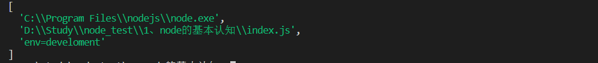

### 1、node 定义

首先，在 node 官网上对其的定义：node.js 是一个基于 Chrome V8 引擎的 JavaScript 运行时


### 2、安装

官网下载，LTS 版本为稳定版本，Current 为当前最新版本，一般都是安装的稳定版

[官网](https://nodejs.org/en/)


### 3、使用 node 执行一个 js 文件

```js
node index.js
```


### 4、node 命令参数

在执行 node 的过程中，参数的传递：

```js
node index.js env=development
```

获取参数，通过 process 这个内置对象，这里的 argv 属性

```js
// index.js 中

const argv = process.argv
```

输出 argv 可以得到：




### 5、常见的全局对象

#### __dirname

获取当前文件所在的路径，**不包含后面的文件名**

#### __filename

获取当前文件所在的路径，**包含后面的文件名**

#### proccess

process 提供了 node 进程中相关的信息，包括运行环境、参数信息等

#### console对象

简单的调试控制台

#### global对象

global 是一个全局对象，事实上 process、console 这些等都有被放到 global 中


除了这些，还有很多对象，比如 定时器 等等